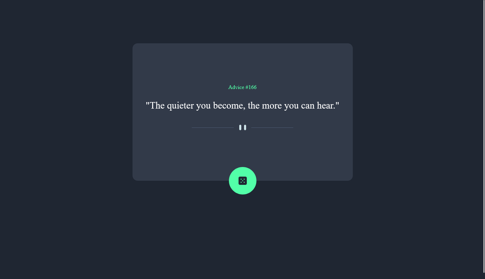

# Frontend Mentor - Advice generator app solution

This is a solution to the [Advice generator app challenge on Frontend Mentor](https://www.frontendmentor.io/challenges/advice-generator-app-QdUG-13db). Frontend Mentor challenges help you improve your coding skills by building realistic projects.

## Table of contents

- [Overview](#overview)
  - [The challenge](#the-challenge)
  - [Screenshot](#screenshot)
  - [Links](#links)
- [My process](#my-process)
  - [Built with](#built-with)
  - [Useful resources](#useful-resources)
- [Author](#author)

## Overview

### The challenge

Users should be able to:

- Read the displayed text generated from adviceslip.com api.
- Click the dice to generate new advice.
- View on mobile and desktop desktop.

### Screenshot

### Links

- Solution URL: [Add solution URL here](https://your-solution-url.com)
- Live Site URL: [Add live site URL here](https://your-live-site-url.com)

## My process

### Built with

- Semantic HTML5 markup
- CSS custom properties
- Flexbox
- Mobile-first workflow
- Vanilla JS

### Useful resources

- [Example resource 1](https://www.w3schools.com/js/js_api_fetch.asp) - This helped me with fetching the api.
- [Example resource 2](https://stackoverflow.com/questions/71255840/fetch-api-return-same-data-always) - This helped me with the fetch request returning the same data with the event listener.

## Author

- Website - [Scott Wilder](www.scott-wilder.com)
- Frontend Mentor - [@Scott-Wilder](https://www.frontendmentor.io/profile/Scott-Wilder)
